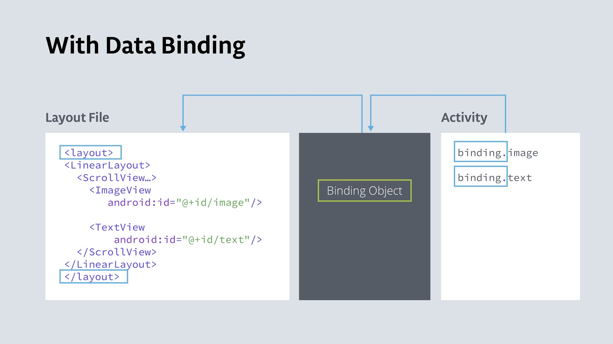

# Data Binding

When an app has complex view hierarchies, `findViewById()` is expensive and slows down the app, because Android traverses the view hierarchy at runtime, starting at the root, until it finds the desired view.

One solution is to create an object that contains a reference to each view. This object, called a `Binding` object, can be used by your whole app. This technique is called *data binding*.



### Benefits

- Code is shorter, easier to read, and easier to maintain
- Data and views are clearly separated
- Android system only traverses the view hierarchy once to get each view, and it happens during app startup, not at runtime when the user is interacting with the app
- Type safety for accessing views

### Summary

1. Enable data binding in the android section of `build.gradle` file:  
    `buildFeatures { dataBinding true }`
2. Use `<layout>` as the root view in the XML layout
3. Define a binding variable:  
    `private lateinit var binding: ActivityMainBinding`
4. Create a binding object in `MainActivity` replacing `setContentView`:  
    `binding = DataBindingUtil.setContentView(this, R.layout.activity_main`
5. Replace calls to `findViewById()` with references to the view in the binding object.  
    E.g., `findViewById<Button>(R.id.done_button)` ⇒ `binding.doneButton`

#### Steps for binding views to data:

1. Create a data class for your data
2. Add a `<data>` block inside the `<layout>` tag
3. Define a `<variable>` with a name and a type that is the data class

```xml
<data>
    <variable name="myName" type="com.ff.aboutme.MyName" />
</data>
```

4. In `MainActivity`, create a variable with an instance of the data class.  
    E.g., `private val myName: MyName = MyName("Frank Faustino")`
5. In the binding object, set the variable to the variable you just created:  
    `binding.myName = myName`
6. In the XML, set the content of the view to the variable that you defined in the `<data>` block. Use dot notation to access the data inside the data class.  
    `android:text="@{myName.name}`

### Expression language

#### Common Features

Mathematical `+ - / * %`\
String concatenation `+`\
Logical `&& ||`\
Binary `& | ^`\
Unary `+ - ! ~`\
Shift `>> >>> <<`\
Comparison `== > < >= <=` (Note that `<` needs to be escaped as `&lt;`)\
`instanceof`\
Grouping `()`\
Literals - character, String, numeric, `null`\
Cast\
Method calls\
Field access\
Array access `[]`\
Ternary operator `?:`

##### Examples:

```xml
android:text="@{String.valueOf(index + 1)}"
android:visibility="@{age > 13 ? View.GONE : View.VISIBLE}"
android:transitionName='@{"image_" + id}'
```

#### Null coalescing operator

`??` chooses left operand if it isn't `null` or the right if the former is `null`

```xml
android:text="@{user.displayName ?? user.lastName}"
```

#### View references

An expression can reference other views in the layout by ID:
```xml
<EditText android:id="@+id/example_text" />
<TextView android:text="@{exampleText.text}" />
```

#### Collections

```xml
<data>
    <import type="android.util.SparseArray" />
    <import type="java.util.Map" />
    <import type="java.util.List" />
    <variable name="list" type="List&lt;String>" />
    <variable name="sparse" type="SparseArray&lt;String>" />
    <variable name="map" type="Map&lt;String, String>" />
    <variable name="index" type="int" />
    <variable name="key" type="String" />
</data>
...
android:text="@{list[index]}"
...
android:text="@{sparse[index]}"
...
android:text="@{map[index]}"
android:text="@{map.key}"
```

#### App Resources

An expression can reference app resources with the following syntax:
```xml
android:padding="@{large? @dimen/largePadding : @dimen/smallPadding}"
```

You can evaluate format strings and plurals by providing parameters:
```xml
android:text="@{@string/nameFormat(firstName, lastName)}"
android:text="@{@plurals/banana(bananaCount)}"
```

You can pass property references and view references as resource parameters:
```xml
android:text="@{@string/example_resource(user.lastName, exampleText.text)}"
```

### Event Handling

#### Method references

Events can be bound to handler methods directly, simlar to the way `android:onClick` can be assigned to a method in an activity. One major advantage compared to `View` `onClick` attribute is that the expression is processed at compile time, so if the method doesn't exist or its signature is incorrect, you receive a compile time error.

The major difference between method references and listener bindings is that the actual listener implementation is created when the data is bound, not when the event is triggered.

```kotlin
class MyHandlers {
  fun onClickFriend(v: View) { ... }
}
```

```xml
<layout>
  <data>
    <variable name="handlers" type="com.example.MyHandlers" />
  </data>
  <LinearLayout>
  <TextView android:onClick="@{handlers::onClickFriend}" />
  </LinearLayout>
</layout>
```

#### Listener bindings

Listener bindings are binding expressions that run when an event happens. They're similar to method references, but they let you run arbitrary data binding expressions.

```kotlin
class Presenter {
  fun onSaveClick(task: Task) {}
}
```

```xml
<layout>
  <data>
    <variable name="task" type="com.example.Task" />
    <variable name="presenter" type="com.example.Presenter" />
  </data>
  <LinearLayout>
  <Button android:onClick="@{() -> presenter.onSaveClick(task))}" />
  </LinearLayout>
</layout>
```

You can use a lambda expression with more than one parameter:

```kotlin
class Presenter {
  fun onSaveClick(view: View, task: Task) {}
}
```

```xml
<Button android:onClick="@{(view) -> presenter.onSaveClick(view, task))}" />
```

If you need to use an expression with a predicate (e.g., a ternary), you can use `void` as a symbol:

```xml
android:onClick="@{(v) -> v.isVisible() ? doSomething() : void}"
```

### Imports, includes

#### Imports

```xml
<data>
    <import type="android.view.View"/>
</data>
...
<TextView
   android:text="@{user.lastName}"
   android:visibility="@{user.isAdult ? View.VISIBLE : View.GONE}" />
```

##### Type alias
```xml
<import type="android.view.View" />
<import type="com.example.real.estate.View" alias="Vista" />
```

#### Includes
Variables may be passed into an included layout's binding from the containing layout by using the app namespace and the variable name in an attribute. The following example shows included `user` variables from the `name.xml` and `contact.xml` layout files:
```xml
<?xml version="1.0" encoding="utf-8"?>
<layout xmlns:android="http://schemas.android.com/apk/res/android"
        xmlns:bind="http://schemas.android.com/apk/res-auto">
   <data>
       <variable name="user" type="com.example.User"/>
   </data>
   <LinearLayout
       android:orientation="vertical"
       android:layout_width="match_parent"
       android:layout_height="match_parent">
       <include layout="@layout/name"
           bind:user="@{user}"/>
       <include layout="@layout/contact"
           bind:user="@{user}"/>
   </LinearLayout>
</layout>
```

### Resources

[Codelabs - Android Kotlin Fundamentals 02.4: Data-binding basics](https://codelabs.developers.google.com/codelabs/kotlin-android-training-data-binding-basics)
[Android Developers - Data Binding](https://developer.android.com/topic/libraries/data-binding/start)
