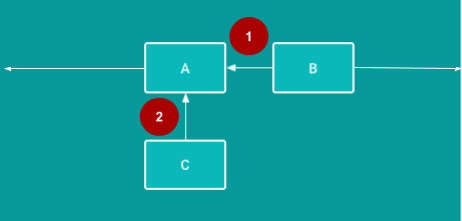

# ConstraintLayout

## Summary

- A [`ConstraintLayout`](https://developer.android.com/reference/android/support/constraint/ConstraintLayout.html) is a [`ViewGroup`](http://developer.android.com/reference/android/view/ViewGroup.html) that allows you to position and size the layout's child views in a flexible way.
- In a constraint layout, each view's position is defined using at least one horizontal constraint, and at least one vertical constraint.
- A [constraint](https://developer.android.com/training/constraint-layout/#constraints-overview) connects or aligns a view to another UI element, to the parent layout, or to an invisible guideline.

Advantages of using `ConstraintLayout`:

- You can make a constraint layout responsive to devices that have different screen sizes and resolutions.
- `ConstraintLayout` usually results in a flatter view hierarchy than `LinearLayout`.
- The design editor and the view inspector in Android Studio help you add and configure constraints.

Chains:

- A [chain](https://developer.android.com/training/constraint-layout/#constrain-chain) is a group of views that are linked to each other with bidirectional constraints.
- The views within a chain can be distributed either vertically or horizontally.

Design-time attributes:

- Design-time attributes are used and applied only during the layout design, not at runtime. When you run the app, design-time attributes are ignored.
- Design-time attributes are prefixed with the `tools` namespace. For example, the `tools:layout_editor_absoluteY` and `tools:text` attributes are design-time attributes.

Baseline constraints:

- A baseline constraint aligns a view's text baseline to the text baseline of another view that has text.
- Baseline constraints are helpful when views have different font sizes

## Constraints
A [constraint](https://developer.android.com/training/constraint-layout/#constraints-overview) is a connection or alignment between two UI elements. Each constraint connects or aligns one view to another view, to the parent layout, or to an invisible guideline. In a constraint layout, you position a view by defining at least one horizontal and one vertical constraint.

**1** Horizontal constraint: B is constrained to stay to the right of A. (In a finished app, B would need at least one vertical constraint in addition to this horizontal constraint.)

**2** Vertical constraint: C is constrained to stay below A. (In a finished app, C would need at least one horizontal constraint in addition to this vertical constraint.)
