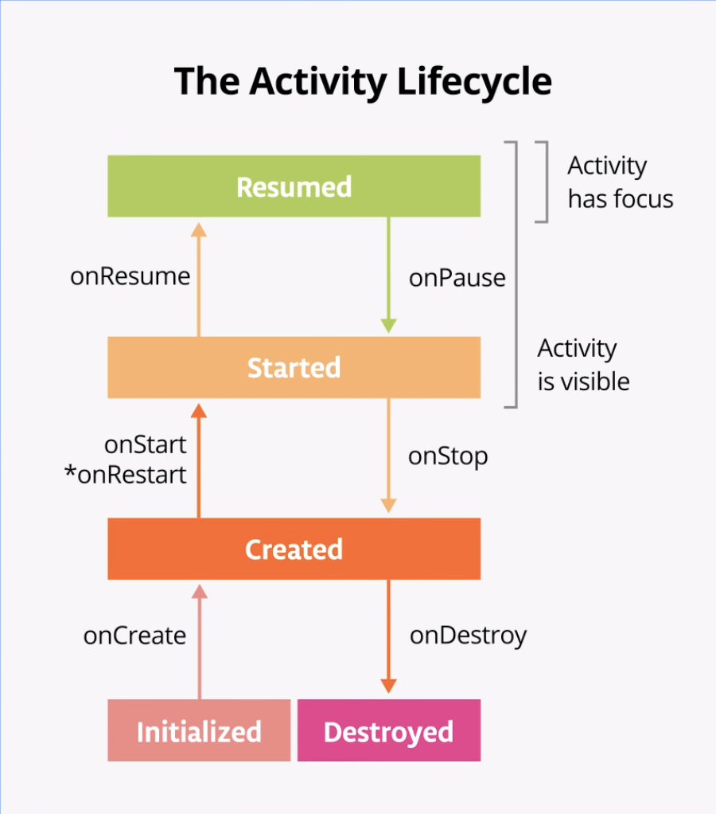
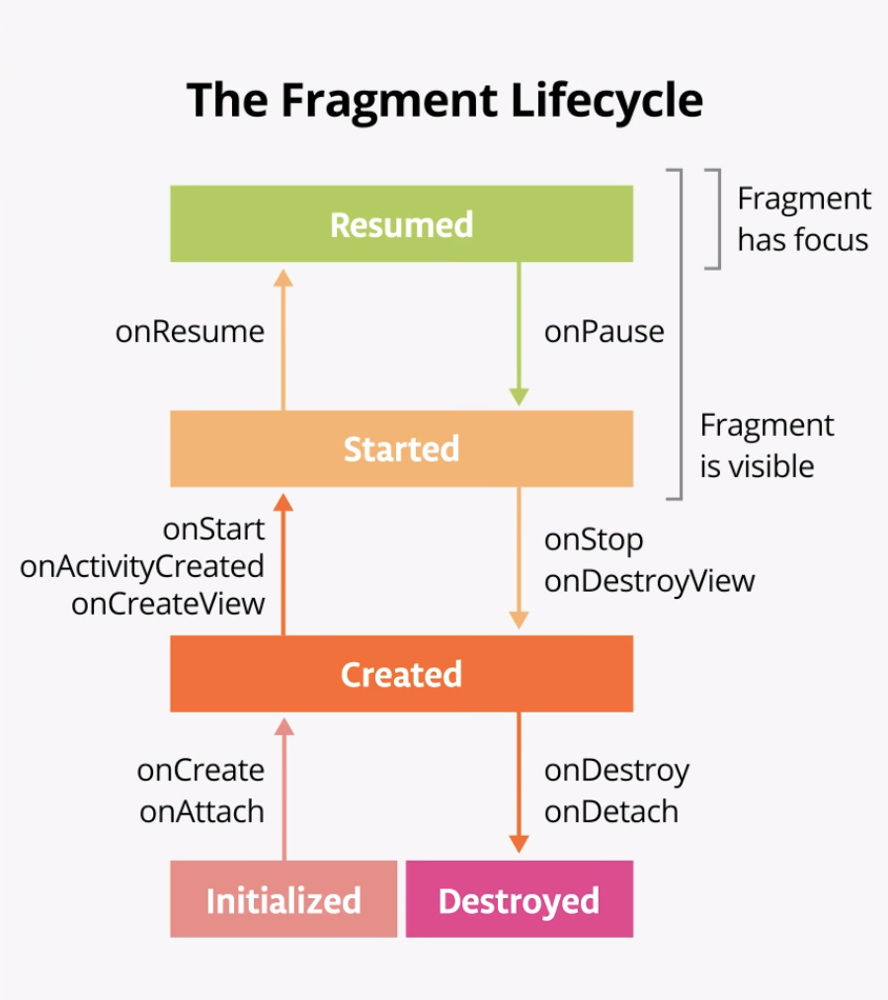

# DessertClicker

DessertClicker is a game about making desserts. Press the button, make a dessert, earn the big bucks.

This app was made to explore the Android lifecycle and logging messages to the Android console (Logcat).

## Content
- [Lifecycle](#lifecycle)

## Lifecycle

Every activity and fragment has a **lifecycle** which is made of the different states that an activity can go through, from when the activity is first initialized to when it is finally destroyed and its memory reclaimed by the system.

### Activity Lifecycle

The `Activity` class, and any subclasses of `Activity` such as `AppCompatActivity`, implements a set of lifecycle callback methods which enables you to run code when an activity lifecycle state changes. You can override these methods to perform tasks in response to those lifecycle state changes.

[`onCreate()`](https://developer.android.com/reference/android/app/Activity.html#onCreate(android.os.Bundle)) - Called only once when the activity is created.
[`onStart()`](https://developer.android.com/reference/android/app/Activity.html#onStart()) — Called after `onCreate()` or after `onRestart()` when the activity had been stopped.
[`onResume()`](https://developer.android.com/reference/android/app/Activity.html#onResume()) - Called when the activity has focus.
[`onPause()`](https://developer.android.com/reference/android/app/Activity.html#onPause()) - Called when activity no longer has focus.
[`onStop()`](https://developer.android.com/reference/android/app/Activity.html#onStop()) - Called when activity is no longer visible on the screen (`Activity` object is still in memory, in the *background*).
    - Not called if the app is partially visible on screen.
[`onRestart()`](https://developer.android.com/reference/android/app/Activity.html#onRestart()) — Called after `onStop()` when the current activity is being re-displayed.
[`onDestroy()`](https://developer.android.com/reference/android/app/Activity.html#onDestroy()) - Called only once when activity is fully shut down and can be garbage collected.

### Fragment Lifecycle

A fragment's lifecycle is similar to an activity's lifecycle:

`onAttach()` — Called when the fragment is associated with its owner activity.
`onCreate()` — Similarly to `onCreate()` for the activity, `onCreate()` for the fragment is called to do initial fragment creation (other than layout).
`onCreateView()` — Called to inflate the fragment's layout.
`onActivityCreated()` — Called when the owner activity's `onCreate()` is complete. Your fragment will not be able to access the activity until this method is called.
`onStart()` — Called when the fragment becomes visible; parallel to the activity's `onStart()`.
`onResume()` — Called when the fragment gains the user focus; parallel to the activity's `onResume()`.

`onPause()` — Called when the fragment loses the user focus; parallel to the activity's `onPause()`.
`onStop()` — Called when the fragment is no longer visible on screen; parallel to the activity's `onStop()`.
`onDestroyView()` — Called when the fragment's view is no longer needed, to clean up the resources associated with that view.

## Lifecycle resources

- [Activities](http://developer.android.com/guide/components/activities.html) (API guide)
- [Fragments](https://developer.android.com/guide/components/fragments) (API guide)
- [`Activity`](http://developer.android.com/reference/kotlin/android/app/Activity.html) (API reference)
- [`Fragment`](https://developer.android.com/reference/kotlin/android/app/Fragment#Lifecycle) (API reference)
- [Understand the Activity Lifecycle](https://developer.android.com/guide/components/activities/activity-lifecycle)

- [The Android Lifecycle cheat sheet — part I: Single Activities](https://medium.com/google-developers/the-android-lifecycle-cheat-sheet-part-i-single-activities-e49fd3d202ab) is a visual recap of much of the material here.
- [The Android Lifecycle cheat sheet — part II: Multiple Activities](https://medium.com/@JoseAlcerreca/the-android-lifecycle-cheat-sheet-part-ii-multiple-activities-a411fd139f24) shows the order of lifecycle calls when two activities interact.
- [The Android Lifecycle cheat sheet — part III: Fragments](https://medium.com/@JoseAlcerreca/the-android-lifecycle-cheat-sheet-part-iii-fragments-afc87d4f37fd) shows the order of lifecycle calls when an activity and fragment interact.