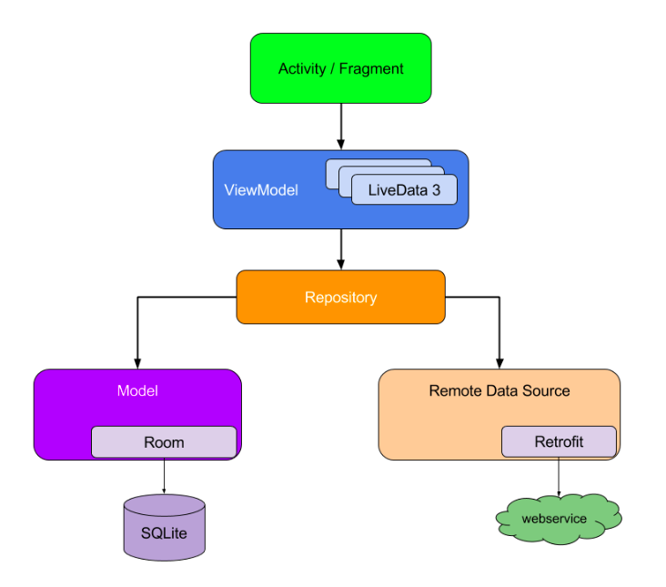

# DevByteViewer

DevByteViewer app displays a list of DevByte videos. DevByte videos are short videos made by the Google Android developer relations team to introduce new developer features on Android. They're also a great way to stay up to date with new features as they come out as well as tips and best practices.

This app fetches the DevByte video list from the network using the Retrofit library and displays it on the screen. It uses a `ViewModel` and `LiveData` to hold the data and update the UI. Since the video list is big, results are displayed in a `RecyclerView`.

***

## Content

- [Repository](#repository)
  - [Caching](#caching)
  - [Repository Pattern](#repository-pattern)
- [Room](#room)
- [WorkManager](#workmanager)
  - [Worker](#worker)
  - [WorkRequest](#workrequest)
- [Resources](#resources)

## Repository

### Caching

Table below shows several ways to implement network [caching](https://searchstorage.techtarget.com/definition/cache) in Android:

| Caching technique | Uses |
|-|-|
| Retrofit is a networking library used to implement a type-safe REST client for Android. You can configure Retrofit to store a copy of every network result locally. | Good solution for simple requests and responses, infrequent network calls, or small datasets. |
| You can use `SharedPreferences` to store key-value pairs. | Good solution for a small number of keys and simple values. You can't use this technique to store large amounts of structured data. |
| You can access the app's internal storage directory and save data files in it. Your app's package name specifies the app's internal storage directory, which is in a special location in the Android file system. This directory is private to your app, and it is cleared when your app is uninstalled. | Good solution if you have specific needs that a file system can solve—for example, if you need to save media files or data files and you have to manage the files yourself. You can't use this technique to store complex and structured data. |
| You can cache data using `Room`, which is an SQLite object-mapping library that provides an abstraction layer over SQLite. | Recommended solution for complex and structured data, because the best way to store structured data on a device's file system is in a local SQLite database. |

### Repository Pattern

The *repository pattern* isolates data sources from the rest of the app.

A *repository* mediates between the data sources (such as persistent models, web services, and caches) and the rest of the app. Diagram below shows how app components such as activities that use `LiveData` might interact with data sources by way of a repository.



#### Advantages of using a repository

A repository module handles data operations and allows you to use multiple backends. In a typical real-world app, the repository implements the logic for deciding whether to fetch data from a network or use results that are cached in a local database.

## Room

`Room` is an SQLite object-mapping library (it provides an abstraction layer over SQLite).

## WorkManager

`WorkManager` API makes it easy to schedule deferrable, asynchronous tasks that must be run reliably.

### Worker

A class that performs synchronously on a background thread provided by `WorkManager` 

### WorkRequest

`WorkRequest` class represents a request to run the worker in the background. Use `WorkRequest` to configure how and when to run the worker task, with the help of `Constraints` such as device plugged in or Wi-Fi connected.

There are two implementations of `WorkRequest`:
- [`OneTimeWorkRequest`]() for one-off tasks
- [`PeriodicWorkRequest`]() for periodic work requests

#### Constraints

You can specify [`Constraints`]() indicating when the `Worker` should run. Constraints include things like whether the device is plugged in, idle, or whether Wi-Fi is connected.

```kotlin
val constraints = Constraints.Builder()
        .setRequiredNetworkType(NetworkType.UNMETERED)
        .setRequiresBatteryNotLow(true)
        .setRequiresCharging(true)
        .apply {
            if (Build.VERSION.SDK_INT >= Build.VERSION_CODES.M) {
                setRequiresDeviceIdle(true)
            }
        }
        .build()
```

### WorkManager

Schedules the `WorkRequest` in a way that spreads out the load on system resources, while honoring the specified constraints.

```kotlin
val repeatingRequest = PeriodicWorkRequestBuilder<RefreshDataWorker>(1, TimeUnit.DAYS)
        .setConstraints(constraints)
        .build()

WorkManager.getInstance().enqueueUniquePeriodicWork(
        RefreshDataWorker.WORK_NAME,
        ExistingPeriodicWorkPolicy.REPLACE,
        repeatingRequest
)
```

## Resources

- [Room Persistence Library](https://developer.android.com/topic/libraries/architecture/room)
- [Guide to app architecture](https://developer.android.com/jetpack/docs/guide)
- [`Room`](https://developer.android.com/jetpack/androidx/releases/room)
- [Room annotations](https://developer.android.com/reference/android/arch/persistence/room/package-summary)
- [`LiveData`](https://developer.android.com/reference/android/arch/lifecycle/LiveData.html)
- [`Transformations.map`](https://developer.android.com/reference/androidx/lifecycle/Transformations#map(androidx.lifecycle.LiveData%3CX%3E,%20androidx.arch.core.util.Function%3CX,%20Y%3E))

- [Defining Work Requests](https://developer.android.com/topic/libraries/architecture/workmanager/how-to/define-work)
- [`WorkManager`](https://developer.android.com/reference/androidx/work/WorkManager)
- [Getting started with `WorkManager`](https://developer.android.com/topic/libraries/architecture/workmanager/basics)
- [Recurring work](https://developer.android.com/topic/libraries/architecture/workmanager/how-to/define-work#schedule_periodic_work)
- [Guide to background processing](https://developer.android.com/guide/background)

- [Introducing WorkManager](https://medium.com/androiddevelopers/introducing-workmanager-2083bcfc4712)
- [WorkManager Basics](https://medium.com/androiddevelopers/workmanager-basics-beba51e94048)