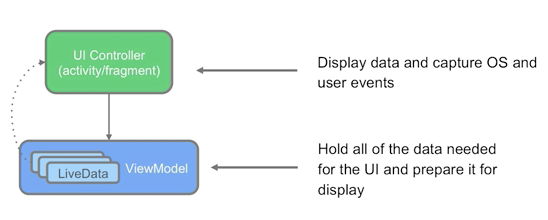

# GuessTheWord

This app is a two player game, GuessTheWord. It is a word guessing app you can play with one or more friends. To play, hold the device in landscape, facing away from you with your thumbs on the **Skip** and **Got It** buttons. Your friends can then give you clues to help you guess the word. If you get the word right, press **Got It**. If you're stuck, press **Skip**.
You will modify the app to use Architecture components and best practices.

## Content
- [Summary](#summary)
- [ViewModel](#viewmodel)
- [ViewModelFactory](#viewmodelfactory)
- [LiveData](#livedata)
- [Resources](#resources)

## Summary

- The Android [app architecture](https://developer.android.com/jetpack/guide) guidelines recommend separating classes that have different responsibilities.
- A *UI controller* is a UI-based class like `Activity` or `Fragment`. UI controllers should only contain logic that handles UI and OS interactions; they shouldn't contain data to be displayed in the UI (put that data in a `ViewModel`).
The [`ViewModel`](https://developer.android.com/reference/android/arch/lifecycle/ViewModel.html) is one of the recommended [Android Architecture Components](https://developer.android.com/jetpack/#architecture-components).



Table below compares UI controllers with the `ViewModel`:

| UI controller | ViewModel |
|---------------|-----------|
| Doesn't contain any data to be displayed in the UI | Contains data that the UI controller displays in the UI |
| Contains code for displaying data, and user-event code such as click listeners | Contains code for data processing |
| Destroyed and re-created during every configuration change | Destroyed only when the associated UI controller goes away permanently—for an activity, when the activity finishes, or for a fragment, when the fragment is detached |
| Contains views | Should never contain references to activities, fragments, or views, because they don't survive configuration changes, but the `ViewModel` does |
| Contains a reference to the associated `ViewModel` | Doesn't contain any reference to the associated UI controller |

## ViewModel

The `ViewModel` class stores and manages UI-related data. It allows data to survive configuration changes such as screen rotations.

## ViewModelFactory

`ViewModelProvider.Factory` is an interface used to create a `ViewModel` object.

## LiveData

`LiveData` lets you build data objects that notify views when the underlying database changes.

The use the `LiveData` class, set up "observers" (e.g., activities or fragments) that observe changes in the app's data. `LiveData` is lifecycle-aware, so it only updates app-component observers that are in an active lifecycle state.

- `LiveData` is observable, which means that an [`Observer`](https://developer.android.com/reference/android/arch/lifecycle/Observer.html) is notified when the data held by the `LiveData` object changes
- `LiveData` holds data; `LiveData` is a wrapper that can be used with any data
- `LiveData` is lifecycle-aware. When you attach an observer to the `LiveData`, the observer is associated with a [`LifecycleOwner`](https://developer.android.com/topic/libraries/architecture/lifecycle#lco) (usually an activity or fragment). The `LiveData` only updates observers that are in an active lifecycle state such as [`STARTED`](https://developer.android.com/reference/android/arch/lifecycle/Lifecycle.State.html#STARTED) or [`RESUMED`](https://developer.android.com/reference/android/arch/lifecycle/Lifecycle.State.html#RESUMED).

```kotlin
val viewModel: GameViewModel = ViewModelProvider(this).get(GameViewModel::class.java)
viewModel.score.observe(viewLifecycleOwner, Observer { newScore -> binding.scoreText.text = newScore.toString() })
viewModel.word.observe(viewLifecycleOwner, Observer { newWord -> binding.wordText.text = newWord.toString() })
```

## Observer pattern

The *observer pattern* specifies communication between objects: an *observable* (the "subject" of observation) and *observers*. An observable is an object that notifies observers about the changes in its state.


## Resources

- [`ViewModel` Overview](https://developer.android.com/topic/libraries/architecture/viewmodel)
- [Handling Lifecycles with Lifecycle-Aware Components](https://developer.android.com/topic/libraries/architecture/lifecycle)
- [Guide to app architecture](https://developer.android.com/jetpack/docs/guide)
- [`ViewModelProvider`](https://developer.android.com/reference/android/arch/lifecycle/ViewModelProvider)
- [`ViewModelProvider.Factory`](https://developer.android.com/reference/android/arch/lifecycle/ViewModelProvider.Factory)

- [`LiveData` Overview](https://developer.android.com/topic/libraries/architecture/livedata)
- [`MutableLiveData`](https://developer.android.com/reference/android/arch/lifecycle/MutableLiveData)

- [MVVM](https://en.wikipedia.org/wiki/Model%E2%80%93view%E2%80%93viewmodel) (model-view-viewmodel) architectural pattern.
- [Separation of concerns](https://en.wikipedia.org/wiki/Separation_of_concerns) (SoC) design principle
- [Factory method pattern](https://en.wikipedia.org/wiki/Factory_method_pattern)
